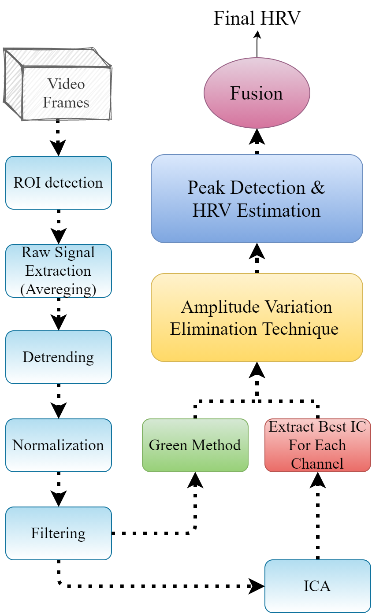

# Remote_PPG
code for paper:
'A Non-contact heart rate estimation framework based on photoplethysmography amplitude variation elimination and data fusion'

we proposed and implement a method with following block diagram for extracting heart rate using face images sequence.

please cite us as follows:
\n
@inproceedings{rasti2021non,
  title={A Non-contact heart rate estimation framework based on photoplethysmography amplitude variation elimination and data fusion},
  author={Rasti-Meymandi, Arash and Karimzadeh, Reza and Zarei, Asghar and Ghaffari, Aboozar},
  booktitle={2021 28th National and 6th International Iranian Conference on Biomedical Engineering (ICBME)},
  pages={236--241},
  year={2021},
  organization={IEEE}
}
